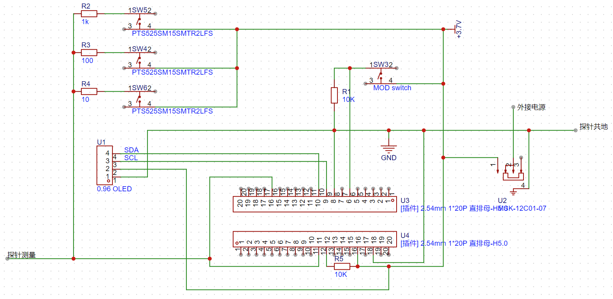
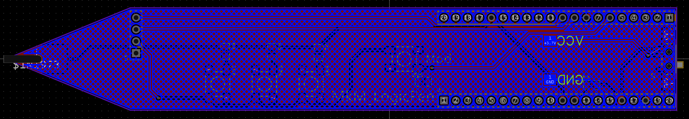

> 图片内容为第一版，oled布局以调整
# MkM_LogicPen


## 介绍
**LogicPen**功能简述:
- 测量并显示标准TTL电平
- 大致测量1~10kΩ范围内的电阻
- 测量占空比

## 已知问题
当前已知且**尚未解决**的问题:
- 当前没有将pwm波形分析功能，后续会单独写一个pwm分析的功能

## 技术协助
你可以在一下获得**技术帮助**:
- [GitHub](https://github.com/yukModule/LogicPen_Raspberry_Pi_pico/)
- [B站](https://space.bilibili.com/22951795)

## 参与作者
- MkM
  - bilibili 无我识l心空妙有

## 使用许可
在该项目中你必须遵守一下条款:
- 随便用，有什么问题后果自负 (oﾟvﾟ)ノ

# 安装说明
> 若不想造成经济损失，请仔细阅读以下内容

## 安装Thonny编译器
- 使用详情，参考Thonny官方教程

## 烧录固件
> 二选其一

- 文件目录：
  - pico_mpy_firmware
    - rp2-pico-20220909-unstable-v1.19.1-389-g4903e48e3.uf2
    - rp2-pico-20210418-v1.15.uf2
- 烧录
  - 按住树莓派pico的bootset键不松手，并使用usb与电脑相连
  - 当电脑出现一个新的盘时松手
  - 将其中一个固件粘贴到该盘中
  - 安全弹出该盘


## 程序下载
> 全部下载

- 文件目录：
  - Download_to_Pico
    - logic_pen.py
    - ssd1306.py

## 运行测试
- 运行logic_pen.py即可

## 开机运行
- 在保证以上没有问题的情况下，在pico根目录新建main.py文件，并保存一下内容

```python
import logic_pen
```

## 二次进入系统
当需要进入mpy系统修改程序时，而开机进入死循环无法进入
- 从新烧录：
  - pico_mpy_firmware
    - flash_nuke.uf2
- 删除 main.py

# 焊接说明

## 注意事项
- 探针未在pcb模拟视图体现出，请准备**直径1.6mm，高25mm的金属探针**
- 在**电源开关处有留出异形铜板**，请在该处焊接合适数量的**排针**
- 自行准备适合的**锂电池**及其**充电保护板**
- 自行准备0.91寸oled iic ssd1306 显示屏
  - 以屏幕在右管脚在左为准，管脚从上到下
    - SDA SCL VCC GND 
- pcb板厚我采用的是1.6mm，建议按照个人需求自行修改

## 物料清单
|标准器件|数量|
|---|---|
|Res_0805 10k|2|
|Res_0805 1k|1|
|Res_0805 100|1|
|Res_0805 10|1|
|PTS525SM15SMTR2LFS|4|
|MSK-12C01-07|4|
|[插件] 2.54mm 1*20P 直排母-H5.0 (可选)|2|
|KH-2.54FH-1X4P-H8.5 (可选)|1|

## 原理图


## PCB



## 3D视图
